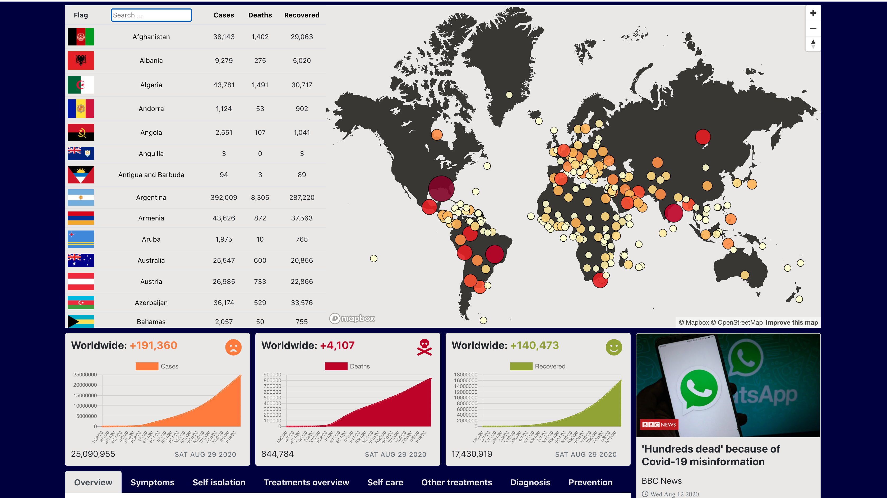
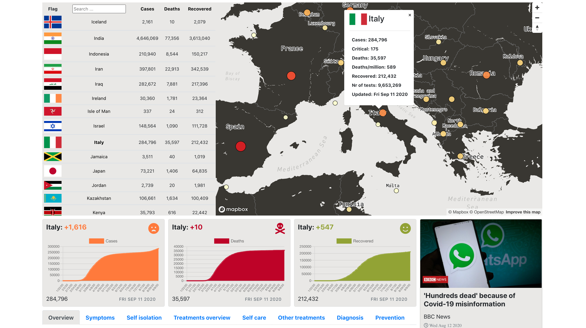
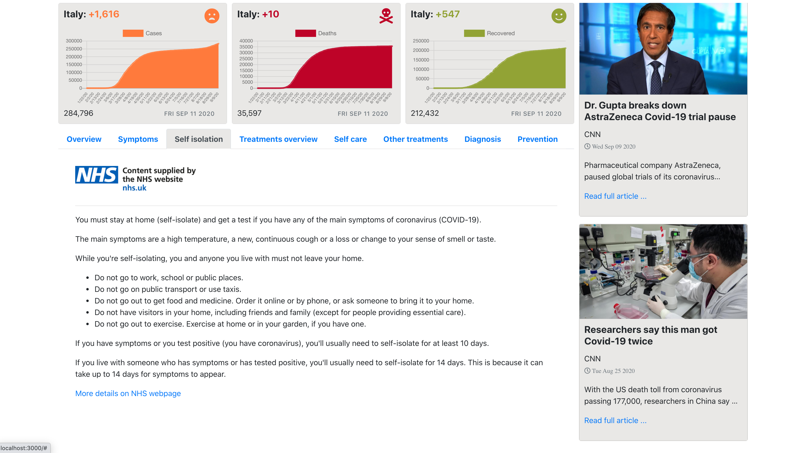

## Covid-19 Tracker

Work in progress ...

#### Screenshots

[](https://www.youtube.com/embed/88msuinkYQE)


[]()
[]()
[]()

### Getting started

Clone this repository to your local machine.

```js
// install dependencies
> npm install

// start server
> npm start

// run tests
> npm test
```

### Approach

The aim of this project was to build something useful and to deepen my understanding of JS, React and Redux. In a previous [project](https://github.com/mbrad26/SpaceX) I took the first steps in the world of React Hooks and React Context API, and so this project is a natural continuation.

I started by making a plan about what sort of functionalities I want the app to offer and what are the best tools to use for this particular project.

First step was to research on how to implement and test a Redux application. I paid particular attention to Redux middleware and sagas for handling data fetching from third parties api.

I decided to use Mapbox GL JS api instead of Google maps and researched on how to integrate live data with the map itself.

For graphical data visualisation I chose Chart.js.

#### Main components:

* Map component: - provides geospatial data visualisation;
* CountriesTable component: - sortable countries list by the number of confirmed, deaths and recovered cases;
* DataCards component: - graphical representation of time-series data for each particular country and also for the world as a whole;
* News component: - news about covid-19 virus from around the world;
* NHS component: - displays up to date information about the covid-19 virus from NHS UK regarding symptoms, treatments, prevention etc.

### Tech Stack

* React
* Redux
* Redux-saga
* Axios
* MapBox-GL JS
* Chart.js
* Bootstrap
